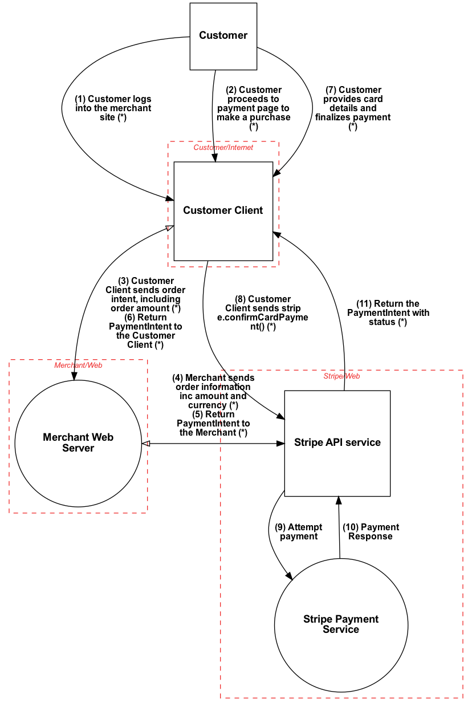

<!-- Edits:
1) changed the dataflow diagram png
2) changed the fourth item {{item.data}} to {{item.?}} (determined from line 957 /usr/local/lib/python3.9/site-packages/pytm/pytm.py) -->

# Threat Model Sample
***

## System Description

{tm.description}

## Dataflow Diagram

## Dataflows

Name|From|To |Data|Protocol|Port
----|----|---|----|--------|----
{dataflows:repeat:{{item.name}}|{{item.source.name}}|{{item.sink.name}}|{{item.data}}|{{item.protocol}}|{{item.dstPort}}
}

## Findings

{findings:repeat:* {{item.description}} on element "{{item.target}}"
}

<!-- ## Findings

{elements:repeat:{{item.findings:if:
### {{item.name}}

{{item.findings:repeat:
**Threat**: {{{{item.id}}}} - {{{{item.description}}}}

**Severity**: {{{{item.severity}}}}

**Mitigations**: {{{{item.mitigations}}}}

**References**: {{{{item.references}}}}

}}}}} -->